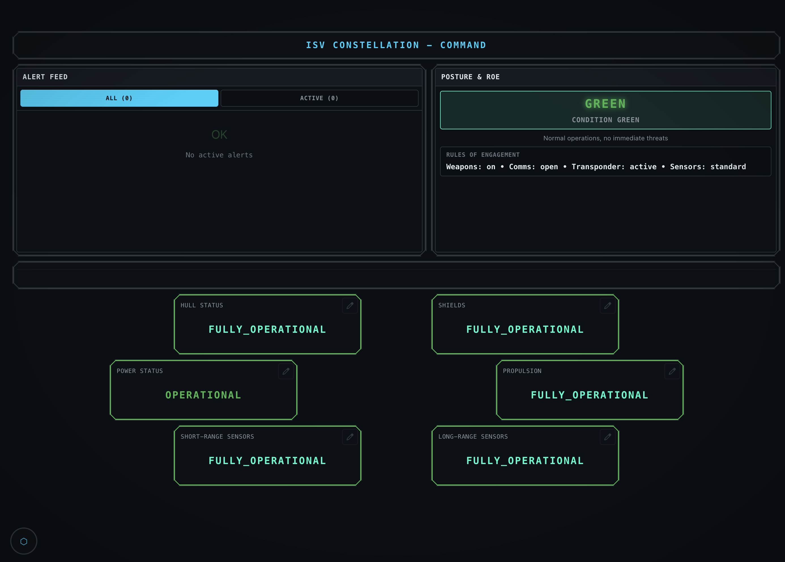

# Starship HUD

An immersive spaceship bridge console for tabletop RPG campaigns.



## What is Starship HUD?

Starship HUD is a web application that gives your tabletop spaceship a real bridge console interface. Players see station-specific displays with live status indicators, alerts, and controls. The GM controls the narrative behind the scenes—triggering damage, spawning contacts, and scripting dramatic moments. Your ship becomes a character with moods, damage states, and evolving conditions.

**[View Screenshots](screenshots/README.md)**

## Quick Start

Getting Starship HUD running takes about 5 minutes.

### Prerequisites

You need [Docker](https://www.docker.com/products/docker-desktop/) installed on your computer. Docker runs the application in a container—think of it as a self-contained package that has everything the app needs.

> **New to Docker?** Download [Docker Desktop](https://www.docker.com/products/docker-desktop/) for Windows, Mac, or Linux. Install it, start it, and you're ready.

### Get Running

1. **Download the project**

   Clone the repository (or download and extract the ZIP):
   ```bash
   git clone <repository-url>
   cd starship-hud
   ```

2. **Start the application**
   ```bash
   docker compose up -d
   ```

   The first time you run this, Docker will download and build everything. This takes a few minutes. Subsequent starts are nearly instant.

3. **Open your browser**

   Go to `http://localhost:7891`

   You'll see the demo ship, ISV Constellation, ready to explore.

That's it! The application comes pre-loaded with a demo ship so you can start exploring immediately.

### Stopping and Starting

```bash
# Stop the application
docker compose down

# Start it again
docker compose up -d

# View logs if something seems wrong
docker compose logs -f
```

## For Game Masters

As the GM, you control the ship behind the scenes:

- **Design custom panels** for each bridge station using 22 different widgets
- **Script dramatic moments** with the scenario system—trigger damage cascades, spawn contacts, send distress calls
- **Control systems in real-time** through the admin panel
- **Send transmissions** that appear on player consoles

See the [GM Guide](docs-user/guide/gm-guide.md) for a complete walkthrough.

## For Players

As a player, you interact with an immersive bridge console:

- **Monitor your station** through dedicated panels (Engineering, Helm, Operations, etc.)
- **See live status updates** with color-coded indicators and alerts
- **Complete tasks** that appear when systems need attention
- **Track contacts** with threat indicators and detailed dossiers

See the [Player Guide](docs-user/guide/player-guide.md) to understand the interface.

## Customization

Starship HUD comes with a demo ship, but it's designed to be yours:

- **Use as much or as little as you want**—start with one panel or build out the whole bridge
- **Create panels for your crew's roles**—not every game needs the same stations
- **Build scenarios for your campaign**—the drama engine adapts to your story
- **Define your own systems**—track whatever matters for your ship

The demo ship is a starting point. Delete it and build your own, or modify it to fit your setting.

## Authentication (Optional)

By default, Starship HUD runs without authentication—anyone with access to the URL can view and edit. For shared or internet-accessible deployments, you can enable authentication.

### Enabling Auth

Set these environment variables (or add to your `.env` file):

```bash
AUTH_ENABLED=true
SECRET_KEY=your-secure-random-string-here
```

### Initial Admin User

On first startup with auth enabled, an admin user is automatically created:

- **Username:** `admin` (configurable via `ADMIN_USERNAME`)
- **Password:** Randomly generated and **printed to the terminal**

Look for this in your startup logs:
```
[bootstrap] Created admin user 'admin' with temporary password: <password>
[bootstrap] Please change this password after first login!
```

The admin must change this password on first login. From there, use the **Config > Users** page to create additional users.

### Environment Variables

| Variable | Default | Description |
|----------|---------|-------------|
| `AUTH_ENABLED` | `false` | Enable authentication |
| `SECRET_KEY` | (random) | Secret for session signing—set this in production |
| `ADMIN_USERNAME` | `admin` | Initial admin username |
| `ADMIN_PASSWORD` | (random) | Initial admin password (printed if not set) |
| `SESSION_LIFETIME_DAYS` | `30` | How long sessions stay valid |

## Documentation

- [Installation Guide](docs-user/getting-started/installation.md) — Detailed setup including Unraid deployment
- [First Run](docs-user/getting-started/first-run.md) — What to do after installation
- [GM Guide](docs-user/guide/gm-guide.md) — Running sessions and managing the ship
- [Player Guide](docs-user/guide/player-guide.md) — Understanding the bridge console
- [Panels](docs-user/guide/panels.md) — Designing and building panels
- [Widgets](docs-user/reference/widgets.md) — Reference for all 22 widget types
- [Scenarios](docs-user/guide/scenarios.md) — Scripting dramatic moments
- [Status States](docs-user/reference/status-states.md) — The visual language of ship status
- [Data Model](docs-user/reference/data-model.md) — How objects relate to each other

## Developer Setup

Want to contribute or run from source? See [CONTRIBUTING.md](CONTRIBUTING.md) for development setup instructions.

The short version: you'll need Node.js 20+, Python 3.12+, and [uv](https://docs.astral.sh/uv/). Run `just setup` then `just dev`.

## Getting Help

This project is in early development and feedback is welcome!

- **Found a bug?** Open an issue on GitHub
- **Have a feature idea?** Start a discussion
- **Questions?** Check the documentation or open a discussion

## License

Private project for tabletop gaming use.
