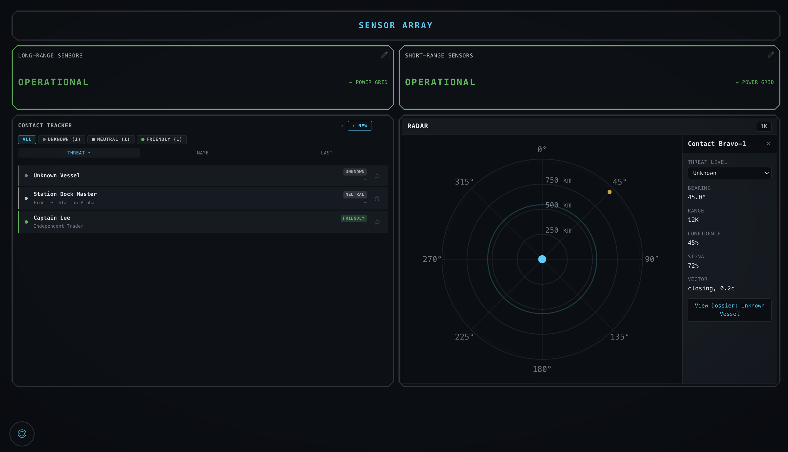

# Screenshots

These screenshots show the demo ship's panels as examples of what you can build. Every panel is fully customizable—the layouts below are starting points, not limitations. You can use as little or as much of what's available to suit your group's needs!

## Contents

**Player Panels**
- [Screenshots](#screenshots)
  - [Contents](#contents)
  - [Player Panels](#player-panels)
    - [Command Panel](#command-panel)
    - [Operations Panel](#operations-panel)
    - [Engineering Panel](#engineering-panel)
    - [Tactical Panel](#tactical-panel)
    - [Comms Panel](#comms-panel)
    - [Sensors Panel](#sensors-panel)
  - [GM Panels](#gm-panels)
    - [GM Dashboard](#gm-dashboard)
    - [Admin Systems](#admin-systems)
    - [Scenario Control](#scenario-control)
  - [Customization](#customization)

**GM Panels**
- [GM Dashboard](#gm-dashboard)
- [Admin Systems](#admin-systems)
- [Scenario Control](#scenario-control)

---

## Player Panels

### Command Panel

**What it's for:** The captain's big-picture view. Command sees ship-wide status at a glance without getting lost in details.

**What's shown here:** Ship overview, threat posture controls, system status summary, and alert feed. The captain can monitor overall health and set the ship's readiness level.

**Make it yours:** Add a radar widget for tactical awareness, a contact tracker for diplomatic situations, or a crew status display if your captain manages personnel directly.

---

### Operations Panel

**What it's for:** The sensors and coordination station. Operations tracks what's happening around the ship and manages information flow.

**What's shown here:** Radar display, contact tracker with expandable dossiers, sensor contact details, and incoming transmissions. The ops officer knows who's out there and what they're saying.

**Make it yours:** Add a ship log for mission continuity, task queue for coordinating crew responses, or data tables for cargo manifests and mission parameters.

---

### Engineering Panel

**What it's for:** Keeping the ship running. Engineering monitors power systems, life support, and damage control.

**What's shown here:** System dependency graph showing how systems affect each other, health bars for critical systems like the reactor and life support, and status indicators for subsystems.

**Make it yours:** Add a task queue for damage control priorities, holomap for tracking breaches and repair crews, or environment summary for atmospheric monitoring.

---

### Tactical Panel

**What it's for:** Weapons and defense. Tactical manages the ship's offensive and defensive capabilities during combat.

**What's shown here:** Weapon asset displays with ammunition counts and readiness status, shield and armor health bars, and targeting information.

**Make it yours:** Add a radar for threat positioning, contact tracker for target prioritization, or posture display if tactical controls weapons safeties.

---

### Comms Panel

**What it's for:** External communications. Comms handles incoming transmissions, hails, and signal analysis.

**What's shown here:** Transmission console with incoming messages, signal details, and message history. The comms officer is the ship's voice to the outside world.

**Make it yours:** Add a contact tracker for managing who you're talking to, alert feed for communication-related events, or crew status if comms coordinates personnel.

---

### Sensors Panel

**What it's for:** Contact management. Handles both dossiers on characters. locations, or other ships as well as radar contacts.

**What's shown here:** 

**Make it yours:** 

---

## GM Panels

GM panels are only visible when you switch to GM mode. They provide behind-the-scenes control over the ship and narrative.

### GM Dashboard

<!--  -->

**What it's for:** Quick access to the most common GM actions. The dashboard is your home base during a session.

**What's shown here:** Quick scenario buttons for one-click drama, ship status overview, recent events, and active tasks. Everything you need to keep the session moving.

**Make it yours:** Pin your most-used scenarios, add a system status overview for quick health checks, or include a transmission console to monitor what players are receiving.

---

### Admin Systems

<!--  -->

**What it's for:** Direct control over ship systems. When you need to manually adjust reactor output or flip a system to critical, this is where you do it.

**What's shown here:** List of all ship systems with current values and status. Click any system to edit its state directly. See dependencies and how changes will cascade.

**Make it yours:** The admin pages are designed for function over form, but you can create custom GM panels with specific system health bars and status displays for quick reference during play.

---

### Scenario Control

<!--  -->

**What it's for:** Managing pre-scripted narrative sequences. Create, edit, rehearse, and execute scenarios from here.

**What's shown here:** List of available scenarios with descriptions, run and rehearse buttons, and execution history. Build your dramatic moments in advance, then trigger them with one click.

**Make it yours:** Organize scenarios by session or story arc. Use rehearsal mode to test timing before your players arrive. Chain scenarios together for complex narrative beats.

---

## Customization

These panels are examples from the demo ship. You can:

- **Rearrange widgets** to match your workflow
- **Add or remove widgets** based on what matters for your game
- **Create entirely new panels** for roles not shown here (Medical, Helm, Science, etc.)
- **Design GM-only panels** for behind-the-scenes control

See the [Panel Guide](../docs-user/guide/panels.md) for how to build your own layouts.
